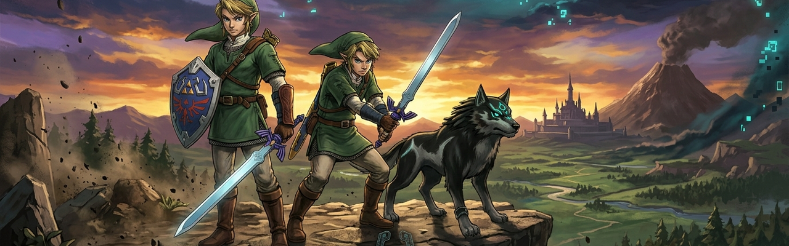
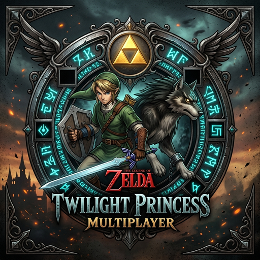

<p align="center">
  
</p>

<div align="center">

#  Twilight Princess Multiplayer Mod

[](#)
[](#requirements)
[](#requirements)
[](#building)
[](LICENSE)

*A minimalist co-op multiplayer framework for The Legend of Zelda: Twilight Princess running natively on the Dusklight PC engine.*

</div>

---

## Key Features

- **Decoupled 3D Puppet Actor (`daGhostPlayer_c`)**: Independent puppet actors rendered with Link's full sub-model hierarchy (body, head, face, hands, sword, and shield) without hijacking camera or single-player state singletons.
- **In-Game GUI & Chat**: Native text dialog (`F6`) to broadcast messages to all heroes, and a visual configuration modal (`F11`) or Dusklight Mods panel tab to configure server IP and port on the fly.
- **World & Co-op Sync**: Real-time synchronization of dungeon chests, small keys, and story progression bits with automatic echo loop prevention.
- **Companion Radar & Beacons**: Visual particle spirit beacons (`0x01B7`) and cardinal direction tracking (`F7`) to easily locate your co-op partner across Hyrule.
- **Form & Status Replication**: Full support for Wolf Link / Human Link transformations, Epona horseback riding, health, and rupees.
- **Low-Latency UDP Protocol**: Non-blocking ENet socket architecture operating at 15 Hz state transmission with local 60 FPS Hermite interpolation.

---

## Architecture Overview

In the original Twilight Princess engine, `daAlink_c` is tightly coupled with `g_dComIfG_gameInfo.play.mPlayer[0]`, controller input polling (`mDoCPd_c`), and camera focus (`dCam_c`). Spawning multiple instances of `daAlink_c` causes camera lockups and immediate crashes on actor deletion.

This mod solves the singleton conflict via a **Puppet Actor pattern**:

```
+-------------------------------------------------------------------------+
|                        Twilight Princess / Dusklight                    |
|                                                                         |
|  +---------------------------+             +--------------------------+ |
|  |       daAlink_c           |             |     daGhostPlayer_c      | |
|  |     (Local Player)        |             |   (Remote Puppet Actor)  | |
|  +---------------------------+             +--------------------------+ |
|  | - player[0] pointer       |             | - Independent fopAc_ac_c | |
|  | - Reads Pad[0] controller |             | - NO player[0] access    | |
|  | - Drives Game Camera      |             | - NO controller polling  | |
|  | - Drives Game Progression |             | - Smooth LERP transform  | |
|  +-------------+-------------+             +------------^-------------+ |
+----------------|----------------------------------------|---------------+
                 |                                        |
                 v                                        | (Updates)
    +---------------------------+            +------------+-------------+
    |   Position & Status       |            |    Interpolation Engine  |
    |       Packets             |            |    (Hermite / Linear)    |
    +-------------+-------------+            +------------^-------------+
                  |                                       |
                  v                                       |
    +-----------------------------------------------------+-------------+
    |                    Network Client (ENet)                          |
    +-------------------------------------------------------------------+
```

For complete technical details, see [ARCHITECTURE.md](ARCHITECTURE.md).

---

## Project Structure

```
tp-multiplayer-mod/
├── ARCHITECTURE.md          # In-depth engine design & singleton analysis
├── CONTRIBUTING.md          # Setup, build, testing & PR guidelines
├── CHANGELOG.md             # Version history
├── CMakeLists.txt           # Build definitions (MSVC / C++20 / Ninja)
├── build_and_deploy.bat     # One-click build and package script
├── mod.json                 # Dusklight mod manifest
├── extern/
│   └── enet/                # ENet UDP networking submodule
└── src/
    ├── main.cpp             # Mod lifecycle (init, update, shutdown, actor registration)
    ├── game/
    │   ├── GhostPlayer.h    # Puppet actor class (daGhostPlayer_c)
    │   ├── GhostPlayer.cpp  # Lifecycle, interpolation, and rendering
    │   ├── ActorInterface.h # Local Link telemetry extraction
    │   └── ActorInterface.cpp
    ├── network/
    │   ├── Client.h         # ENet client network loop
    │   ├── Client.cpp
    │   ├── NetworkTypes.h   # Wire structs and packet enums
    │   ├── PacketSerializer.h
    │   ├── PacketSerializer.cpp # Big-endian bitstream serialization
    │   └── ConnectionConfig.h   # Environment variable overrides
    ├── test_main.cpp        # Serialization & protocol unit tests
    └── server_simulator.cpp # Dedicated relay server with Ghost Mode
```

---

## Requirements

1. **Operating System**: Windows 10/11 (64-bit).
2. **Compiler & Toolchain**: Visual Studio 2022+ (MSVC 64-bit) with C++20 support.
3. **Build System**: CMake 3.25+ and Ninja.
4. **Dusklight Source**: Located in the sibling directory `../dusklight`.
5. **Git Submodules**: ENet initialized inside `extern/enet/`.

---

## Building

### Quick Build Script
Run the automated build script:
```cmd
build_and_deploy.bat
```

### Manual Build (x64 Native Tools Command Prompt)
```cmd
# 1. Update submodules
git submodule update --init --recursive

# 2. Configure with Ninja
cmake -G Ninja -B build-msvc -DCMAKE_BUILD_TYPE=RelWithDebInfo

# 3. Build mod, server, and test suite
cmake --build build-msvc
```

The compiled mod package will be located at:
`build-msvc/mods/tp_multiplayer_mod.dusk`

---

## Testing & Running

### 1. Run Unit Tests
```cmd
.\build-msvc\test_main.exe
```

### 2. Start the Dedicated Relay Server
```cmd
.\build-msvc\server_simulator.exe
```
By default, the server listens on port `1234`.

### 3. Deploy the Mod to Dusklight
Copy the generated `.dusk` package into Dusklight's mod directory:
```cmd
copy build-msvc\mods\tp_multiplayer_mod.dusk ..\dusklight\mods\
```

### 4. Server Connection & In-Game Controls

You can connect to a server in three convenient ways:
- **In-Game GUI Modal (`F11`)**: Opens a native text dialog inside Dusklight to type the Server IP and Port.
- **Dusklight Mods Tab**: Open the main menu, navigate to the **Mods** window, select **Twilight Princess Multiplayer**, and manage IP, port, and connection with live session telemetry.
- **Configuration File / Environment Variables**: Edit `multiplayer_config.txt` or configure:
  ```cmd
  set TP_MULTIPLAYER_HOST=192.168.1.50
  set TP_MULTIPLAYER_PORT=1234
  ```

#### Keyboard Verification Suite

| Hotkey | Action | Description |
| :---: | :--- | :--- |
| **`F1`** | **Help Guide** | Displays on-screen guide of all multiplayer controls and hotkeys. |
| **`F2`** | **Diagnostics** | Real-time status toast: connection state, Hero ID, stage, room, HP, rupees, form. |
| **`F3`** | **Toggle 3D Dummy** | Spawns a 3D puppet dummy (Hero 200) in front of Link on first press; despawns on second press. |
| **`F4`** | **Dummy Motion** | Cycles dummy motion between Idle (Bind pose), Orbit (360° rotation), and Patrol walking. |
| **`F5`** | **World Sync Test** | Simulates chest opening, small key updates, and story flags across network. |
| **`F6`** | **In-Game Chat** | Opens interactive text box modal to broadcast custom chat messages to peers. |
| **`F7`** | **Companion Radar** | Pings spirit particle beacon (`0x01B7`) and cardinal direction of other players. |
| **`F8`** | **Wolf / Human Form** | Toggles Link between Wolf and Human forms in real time. |
| **`F9`** | **Quick Reconnect** | Fast reconnect against configured multiplayer host and port. |
| **`F10`** | **Reload Puppets** | Cleans up and re-instantiates all remote 3D player actors. |
| **`F11`** | **Connection Dialog** | Opens native modal dialog to change server IP and port on the fly. |

---

## Contributing

We welcome contributions! Please review [CONTRIBUTING.md](CONTRIBUTING.md) for environment setup, code conventions, and guidelines on synchronizing animations, equipment, and items.

---

## License

This project is licensed under the MIT License. See [LICENSE](LICENSE) for details.

*All Zelda: Twilight Princess assets, engine code, and trademarks belong to Nintendo. The Dusklight PC port is the work of its respective authors.*
